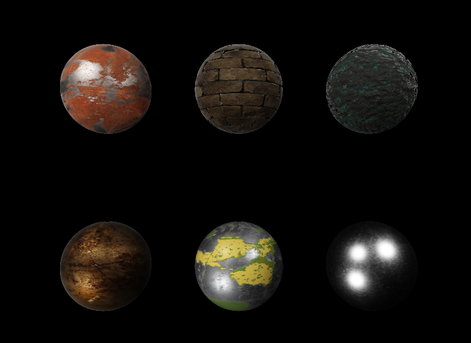
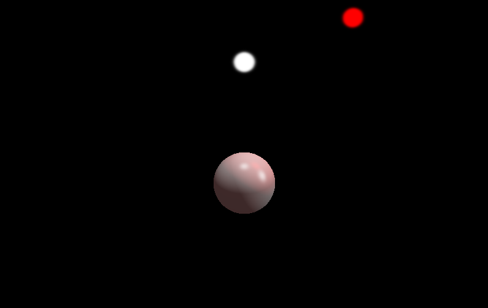
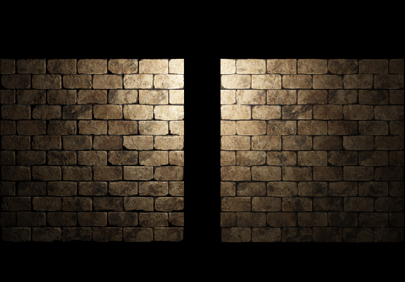
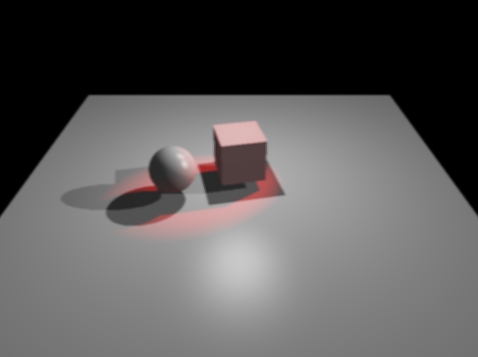
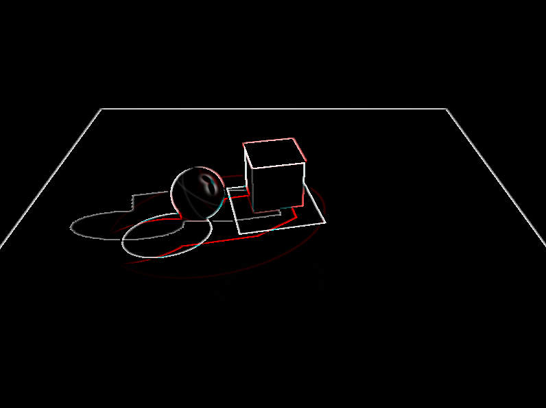
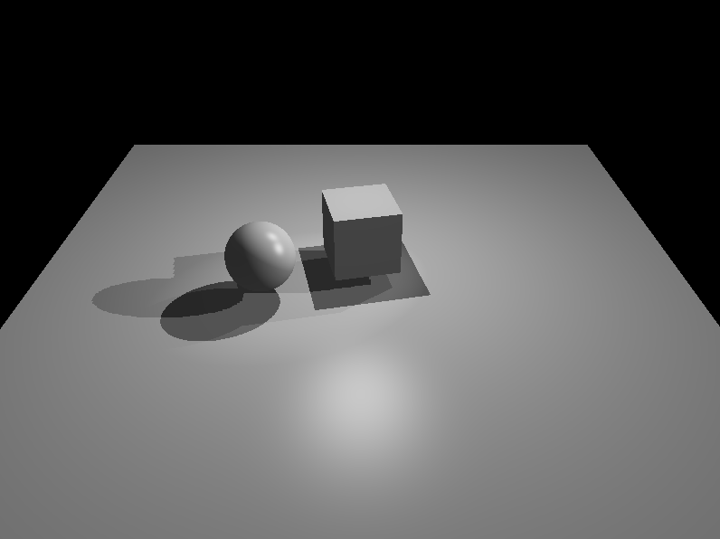
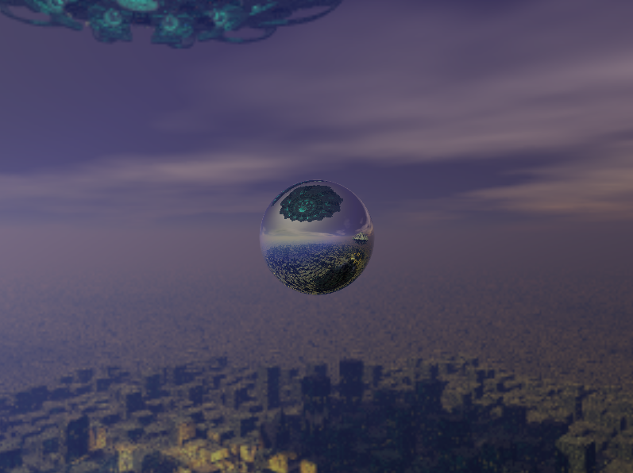
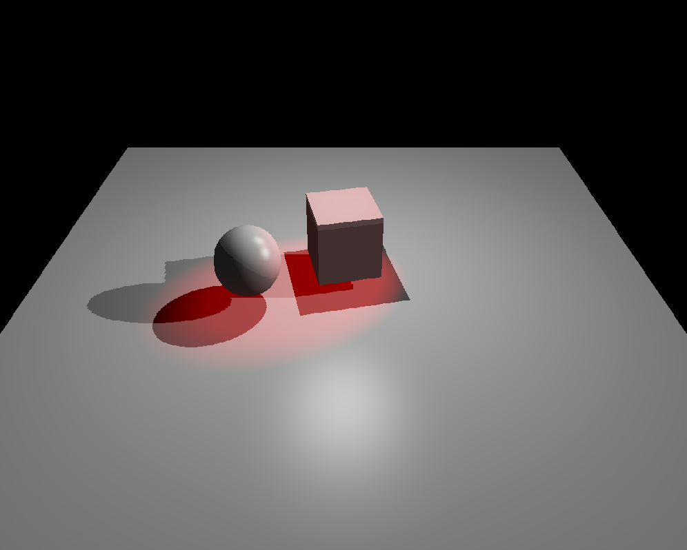
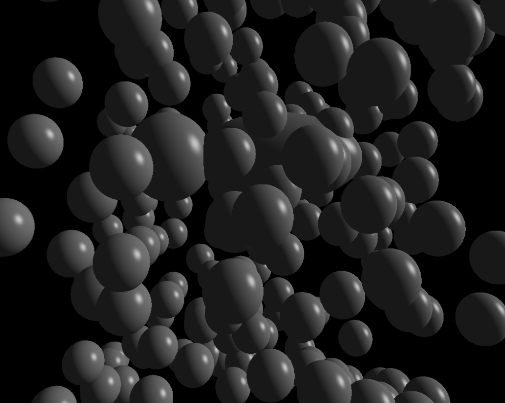

# rit3d
rit3d是基于OpenGL API的游戏渲染引擎，主要用来学习和实践计算机图形学和游戏引擎相关知识。

rit3d采用类似Unity3D的组件实体系统架构。

## 已实现的组件
* transform：几何变换
* light：光源
* camera：相机
* render：渲染
* behavior：行为脚本
* post process：后处理
* skybox：天空盒
* collider：碰撞

## 已实现的主要功能
### 光照和阴影
如下图，本示例内的游戏对象(gameObject)采用phong材质，实时阴影采用shadow map技术。示例中包含三种类型的光源：立方体正上方的白色点光源、斜上方的白色平行光和红色的聚光灯。


### PBR材质

如下图，本示例采用基于物理的渲染(PBR材质)，六个球体的PBR材质贴图均来自[https://freepbr.com/c/base-metals/](https://freepbr.com/c/base-metals/)。



### HDR和泛光材质

本引擎默认采用高动态范围颜色(HDR)。泛光是为了模拟发光物，下图中白色球和红色球是两个点光源。



### 法线贴图

如下图，左边使用法线贴图，右边没有。



### 行为脚本

behavior组件使用户可以自己定义游戏对象的行为方式。在该组件中，用户需要自己写一个继承自BaseBehavior的类，并把它的实例绑定到behavior组件上(与Unity3D中脚本绑定方法类似)。

```
class TestScript : public BaseBehavior {

public:
	DWORD startTime;
	float speed{ 0.2f };

	virtual void onStart() {
		startTime = ::GetTickCount();
	}
	virtual void onUpdate() {
		DWORD delta = ::GetTickCount() - startTime;
		float angle = (float)delta / 1000.0f * speed;
		gameObject->transform->setLocalFrontDir(sin(angle), -0.2f, cos(angle));
	}
	virtual void onLateUpdate() {

	}
};
```

onStart()方法在脚本绑定到游戏对象上的下一帧执行，onUpdate()方法每帧执行。

### 后期处理

post process组件负责后期处理，该组件必须和camera组件挂在同一个gameObject下才能发挥作用，下图是三种常见的后期处理效果。左上：原图，右上：模糊，左下：边缘检测，右下：灰度化。



### 天空盒和环境映射
skybox组件负责天空盒，该组件必须和camera组件挂在同一个gameObject下才能发挥作用，模型可以选用环境映射材质，但只有在有天空盒的情况下才会生效。



### 延迟渲染
deferred rendering 适用于多光源渲染。左图采用forward rendering，右图采用deferred rendering。目前deferred rendering在渲染阴影时有错位的问题。



### 碰撞
目前使用sphere包围盒做碰撞检测，之后会提供OBB等包围盒。

目前采用了BVH技术、和八叉树进行碰撞检测优化。下图是一个包含202个球体的场景，球体位置随机生成，采用sphere包围盒。每一帧要检测所有球体间的碰撞关系。检测结果是有86对碰撞。



经过对一帧的观察发现。暴力方法中，基础检测算法共执行20301，耗时17ms；采用BVH后，基础检测算法共执行8469次，相比暴力方法减少了58.3%，耗时13ms，相比暴力方法减少了23.5%；采用八叉树后，基础检测算法共执行11386次，相比暴力方法减少了43.9%，耗时7ms，相比暴力方法减少了58.8%。

目前BVH存在的问题是，当需要碰撞检测的物体数量较少时，构建、维护和遍历BVH树所花费的时间超过了其节省的时间，因此还需要一些其它手段优化。

在本例中，八叉树的深度为2。从本例来看，采用八叉树做场景管理的性能最佳。

之后还会尝试BSP技术。

